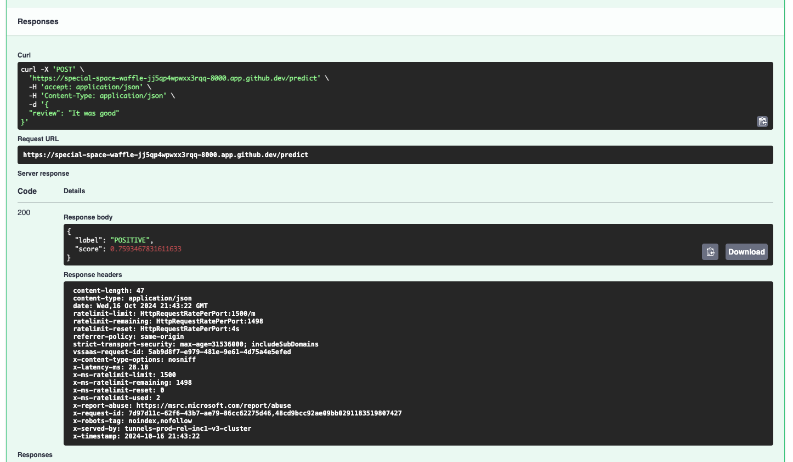
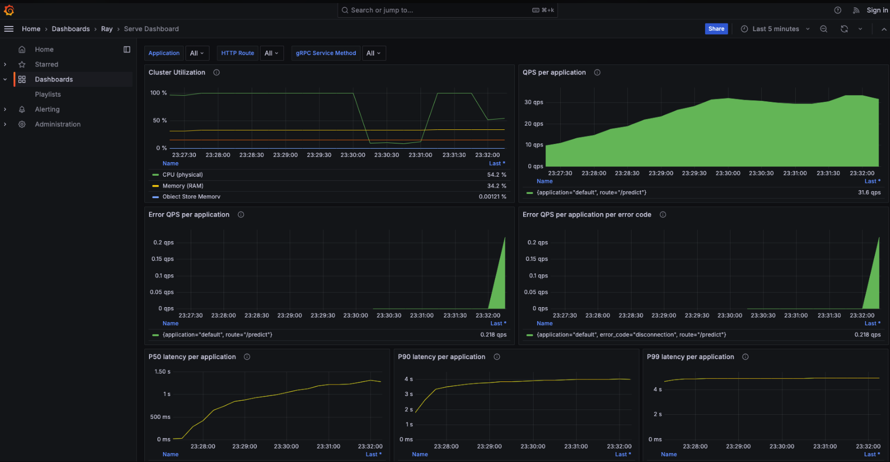
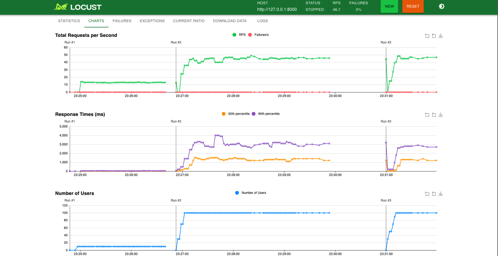
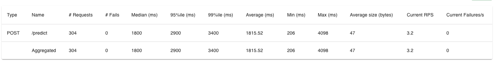
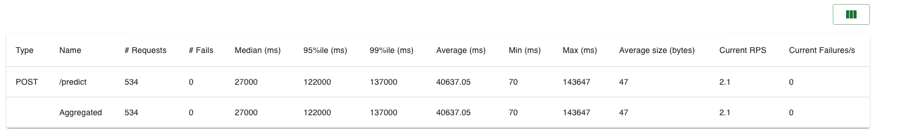
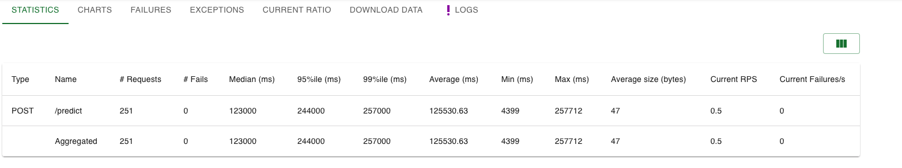

## MLOps: From Models to Production


**Query the API of our ML Model**


**Robustify your application by adding in E2E Tests**
Ran successfully

```
All checks passed!
  py310: OK (26.57=setup[0.10]+cmd[1.32,25.15] seconds)
  lint: OK (1.82=setup[0.01]+cmd[1.33,0.48] seconds)
  congratulations :) (28.52 seconds)
```

**Monitoring & Observability using Grafana & Prometheus**

**Graffana**



**Load Test**



**Optional Tasks**

**Task 1: Improve Logging in the Application**

Custom Middleware in FastAPI

**Response Headers (X-Request-ID,X-Timestamp,X-Latency-ms)**


**Sample log**

```
INFO     | src.server:log_and_inject_metadata:42 - Request ID: 0ffe55c0-aec4-4715-8ea9-763d3e14324d, Timestamp: 2024-10-16 21:48:34, Latency: 48.60ms, Input: {"review": "Hello world this is the best product ever!"}
```
**Task 2: Experiment with Load Tests**

We start with 10 users and gradually ramp up to 1000 over a few minutes.

**Gradual Ramp-Up** - Simulate a gradual increase in users to see how your API handles growing load
```
locust -f load_test/average_test.py --host=http://127.0.0.1:8000 --users 10 --spawn-rate 10 --run-time 5m
```

- Number of replicas: 1
- Number of CPUs/Memory: Each replica is allocated 0.2 CPUs



```
locust -f load_test/average_test.py --host=http://127.0.0.1:8000 --users 1000 --spawn-rate 10 --run-time 5m --web-port 8090
```
- Number of replicas: 3
- Number of CPUs/Memory: Each replica is allocated 0.2 CPUs



**Spike Test** - Simulate a sudden surge in traffic

We will simulate a sudden surge in traffic by starting with 1000 users immediately and observing how the system handles the load.

```
locust -f load_test/average_test.py --host=http://localhost:8000 --users 1000 --spawn-rate 1000
```
- Number of replicas: 3
- Number of CPUs/Memory: Each replica is allocated 0.2 CPUs
  


**Task 3: Integrate Behavioral Test into Automated Test Setup**

Tested successfully (project/tests/test_behavioral.py)
